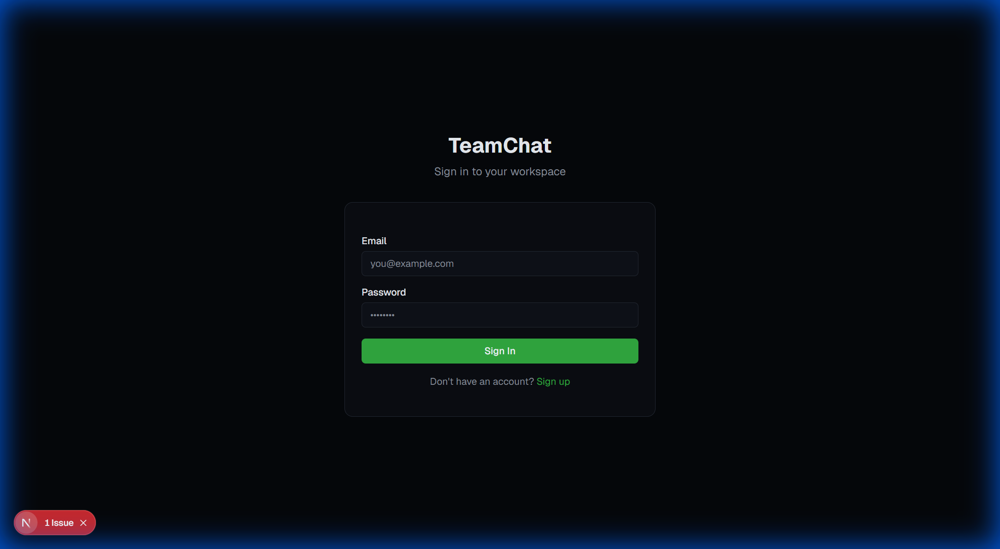
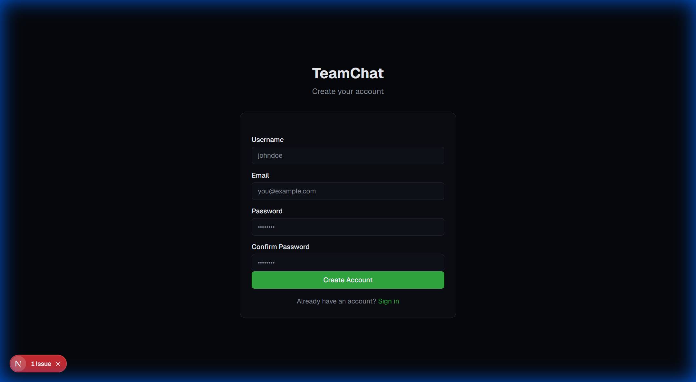
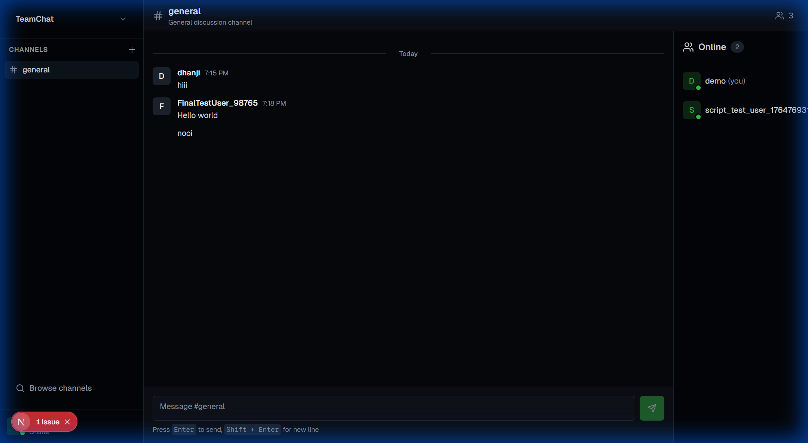
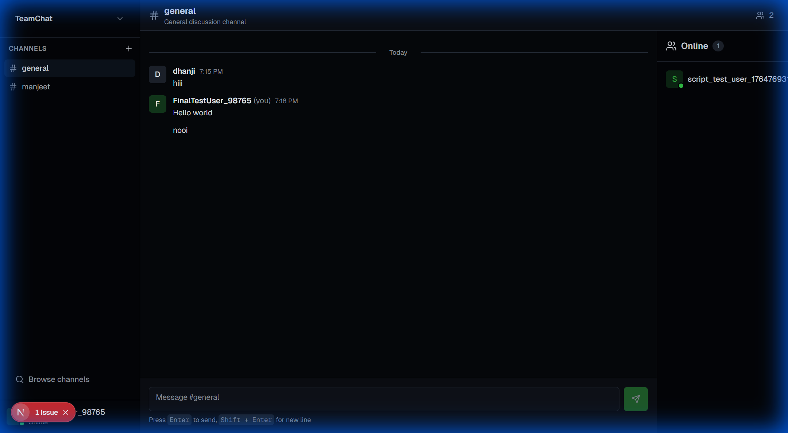

<div align="center">

# 💬 TeamChat - Real-time Team Communication Platform

<p align="center">
  
  
  
  

</p>

<p align="center">
  <strong>A modern, feature-rich team chat application with real-time messaging, channel management, and user presence tracking.</strong>
</p>

<p align="center">
  <a href="#-features">Features</a> •
  <a href="#-screenshots">Screenshots</a> •
  <a href="#-quick-start">Quick Start</a> •
  <a href="#-tech-stack">Tech Stack</a> •
  <a href="#-api-documentation">API</a> •
  <a href="#-contributing">Contributing</a>
</p>

</div>

---

## ✨ Features

### 🚀 Core Functionality

- **Real-time Messaging** - Instant message delivery using Server-Sent Events (SSE)
- **Channel Management** - Create, join, and leave public/private channels
- **User Presence** - Real-time online/offline status tracking
- **Message History** - Infinite scroll with cursor-based pagination
- **User Authentication** - Secure JWT-based authentication with HTTP-only cookies

### 🎨 User Experience

- **Responsive Design** - Fully responsive UI that works on all devices
- **Dark Mode** - Built-in dark mode support with theme persistence
- **Modern UI** - Beautiful interface built with Tailwind CSS and Shadcn UI
- **Real-time Updates** - See messages and user status updates instantly
- **Smooth Animations** - Polished micro-interactions and transitions

### 🔒 Security & Performance

- **Password Hashing** - Bcrypt encryption for user passwords
- **HTTP-only Cookies** - Secure session management
- **MongoDB Indexing** - Optimized database queries
- **Connection Pooling** - Efficient database connections
- **Rate Limiting** - API protection (in production setup)

---

## 📸 Screenshots

### Login Page

<div align="center">
  
  <p><em>Clean and modern login interface with form validation</em></p>
</div>

### Signup Page

<div align="center">
  
  <p><em>User registration with real-time validation</em></p>
</div>

### Main Chat Interface

<div align="center">
  
  <p><em>Feature-rich chat interface with channel sidebar, message list, and online users</em></p>
</div>

### User Menu

<div align="center">
  
  <p><em>User profile menu with logout functionality</em></p>
</div>

---

## 🛠️ Tech Stack

### Frontend

- **Framework**: Next.js 16.0 (App Router)
- **UI Library**: React 19.2
- **Styling**: Tailwind CSS 4.1
- **Component Library**: Shadcn UI (Radix UI primitives)
- **Icons**: Lucide React
- **State Management**: SWR for data fetching
- **Form Handling**: React Hook Form + Zod validation

### Backend

- **Runtime**: Node.js 18+
- **API**: Next.js API Routes
- **Database**: MongoDB 7.0 with Mongoose ODM
- **Authentication**: Custom JWT implementation (jose library)
- **Real-time**: Server-Sent Events (SSE)
- **Password Hashing**: bcryptjs

---

## 🚀 Quick Start

### Prerequisites

- Node.js 18+ installed
- MongoDB instance (local or Atlas)

### Local Development

```bash
# 1. Clone the repository
git clone <your-repo-url>
cd team-chat-application

# 2. Install dependencies
npm install

# 3. Set up environment variables
cp .env.local.example .env.local
# Edit .env.local with your MongoDB URI and JWT secret

# 4. Start MongoDB (if running locally)
mongod

# 5. Run the development server
npm run dev

# 6. Open your browser
open http://localhost:3000
```

### Environment Variables

Create a `.env.local` file in the root directory:

```env
MONGODB_URI=mongodb://localhost:27017/team-chat
JWT_SECRET=your-super-secret-jwt-key-change-in-production
NEXT_PUBLIC_APP_URL=http://localhost:3000
```

---

## 📁 Project Structure

```
team-chat-application/
├── app/                          # Next.js App Router
│   ├── (auth)/                   # Authentication pages
│   │   ├── login/                # Login page
│   │   └── signup/               # Signup page
│   ├── api/                      # API routes
│   │   ├── auth/                 # Authentication endpoints
│   │   ├── channels/             # Channel management
│   │   ├── messages/             # Message handling
│   │   └── presence/             # User presence tracking
│   ├── chat/                     # Main chat interface
│   ├── globals.css               # Global styles
│   └── layout.tsx                # Root layout
├── components/                   # React components
│   ├── auth/                     # Authentication components
│   ├── chat/                     # Chat-specific components
│   │   ├── channel-sidebar.tsx   # Channel list sidebar
│   │   ├── message-list.tsx      # Message display
│   │   ├── message-input.tsx     # Message composer
│   │   └── online-users.tsx      # Online users list
│   └── ui/                       # Shadcn UI components
├── hooks/                        # Custom React hooks
│   ├── use-messages.ts           # Message management
│   └── use-presence.ts           # Presence tracking
├── lib/                          # Utility functions
│   ├── models/                   # Mongoose schemas
│   │   ├── user.ts               # User model
│   │   ├── channel.ts            # Channel model
│   │   └── message.ts            # Message model
│   ├── auth.ts                   # Authentication logic
│   ├── mongodb.ts                # Database connection
│   └── utils.ts                  # Helper functions

└── package.json                  # Dependencies
```

---

## 🔄 Application Flow

### 1. Authentication Flow

```
User → Signup/Login → JWT Generated → HTTP-only Cookie Set → Redirect to /chat
```

### 2. Real-time Messaging Flow

```
User Types Message → POST /api/messages/send → Save to MongoDB →
Broadcast via SSE → All Connected Clients Receive → UI Updates
```

### 3. Presence Tracking Flow

```
User Logs In → POST /api/presence → SSE Connection →
Broadcast Online Status → Other Users See Green Indicator
```

### 4. Channel Management Flow

```
Create Channel → POST /api/channels → Add Creator as Member →
Fetch Channels → Display in Sidebar → Select Channel → Load Messages
```

---

## 🎯 Key Features Explained

### Real-time Messaging with SSE

Instead of WebSockets, this application uses **Server-Sent Events (SSE)** for real-time updates:

- **Simpler Implementation**: No need for WebSocket server setup
- **HTTP-based**: Works through firewalls and proxies
- **Automatic Reconnection**: Built-in browser support
- **One-way Communication**: Perfect for server → client updates

```typescript
// Client subscribes to message stream
const eventSource = new EventSource(
  `/api/messages/stream?channelId=${channelId}`
);

eventSource.onmessage = (event) => {
  const data = JSON.parse(event.data);
  if (data.type === "new_message") {
    addMessageToUI(data.message);
  }
};
```

### Cursor-based Pagination

Efficient message loading with cursor-based pagination:

```typescript
// Load older messages
GET /api/messages?channelId=123&cursor=msgId&limit=50
```

### JWT Authentication

Secure authentication using HTTP-only cookies:

- **JWT Token**: Signed with HS256 algorithm
- **HTTP-only Cookie**: Cannot be accessed by JavaScript
- **7-day Expiration**: Automatic session management
- **Secure Flag**: HTTPS-only in production

---

## 📚 API Documentation

### Authentication Endpoints

#### POST `/api/auth/signup`

Create a new user account.

**Request Body:**

```json
{
  "username": "john_doe",
  "email": "john@example.com",
  "password": "securepassword123"
}
```

**Response:**

```json
{
  "user": {
    "id": "507f1f77bcf86cd799439011",
    "username": "john_doe",
    "email": "john@example.com",
    "avatar": ""
  }
}
```

#### POST `/api/auth/login`

Authenticate existing user.

#### POST `/api/auth/logout`

End user session.

### Channel Endpoints

#### GET `/api/channels`

Get all channels for authenticated user.

#### POST `/api/channels`

Create a new channel.

#### POST `/api/channels/:id/join`

Join an existing channel.

#### POST `/api/channels/:id/leave`

Leave a channel.

### Message Endpoints

#### GET `/api/messages?channelId=:id&cursor=:cursor&limit=:limit`

Get messages for a channel with pagination.

#### POST `/api/messages/send`

Send a new message.

#### GET `/api/messages/stream?channelId=:id`

Subscribe to real-time message updates (SSE).

### Presence Endpoints

#### GET `/api/presence`

Get list of online users.

#### POST `/api/presence`

Update user online status.

#### GET `/api/presence/stream`

Subscribe to presence updates (SSE).

---

## 🔐 Security Best Practices

### Implemented Security Measures

✅ **Password Security**

- Bcrypt hashing with salt rounds
- Minimum 6 character requirement
- No password storage in plain text

✅ **Session Management**

- HTTP-only cookies (XSS protection)
- Secure flag in production (HTTPS only)
- SameSite attribute (CSRF protection)
- 7-day expiration

✅ **Database Security**

- MongoDB authentication enabled
- Connection string in environment variables
- Input validation with Zod schemas
- Mongoose schema validation

✅ **API Security**

- Authentication middleware on protected routes
- Rate limiting (in production with Nginx)
- CORS configuration
- Input sanitization

### Production Security Checklist

- [ ] Change default JWT_SECRET to strong random string (32+ characters)
- [ ] Use strong MongoDB credentials
- [ ] Enable HTTPS with SSL certificates
- [ ] Configure Nginx rate limiting
- [ ] Set up firewall rules
- [ ] Enable MongoDB authentication
- [ ] Use environment-specific secrets
- [ ] Implement API rate limiting
- [ ] Add request logging
- [ ] Set up monitoring and alerts

---

## 📈 Performance Optimizations

### Implemented Optimizations

✅ **Database**

- Indexes on frequently queried fields
- Connection pooling with Mongoose
- Cursor-based pagination for messages
- Selective field population

✅ **Frontend**

- SWR for client-side caching
- Optimistic UI updates
- Lazy loading of messages
- Debounced input handlers

✅ **Backend**

- Standalone Next.js output for Docker
- Multi-stage Docker builds
- Nginx caching and compression
- SSE connection management

✅ **Build**

- Tree shaking
- Code splitting
- Image optimization
- CSS purging

---

## 🧪 Testing

### Manual Testing Checklist

- [ ] User can sign up with valid credentials
- [ ] User can log in with correct credentials
- [ ] User cannot log in with wrong credentials
- [ ] User can create a new channel
- [ ] User can join existing channels
- [ ] User can send messages in channels
- [ ] Messages appear in real-time for all users
- [ ] User presence updates in real-time
- [ ] User can log out successfully
- [ ] Dark mode toggle works
- [ ] Responsive design works on mobile
- [ ] Infinite scroll loads older messages

### Running Tests

```bash
# Run linter
npm run lint

# Type checking
npx tsc --noEmit

# Build test
npm run build
```

---

## 🤝 Contributing

Contributions are welcome! Please follow these steps:

1. Fork the repository
2. Create a feature branch (`git checkout -b feature/amazing-feature`)
3. Commit your changes (`git commit -m 'Add amazing feature'`)
4. Push to the branch (`git push origin feature/amazing-feature`)
5. Open a Pull Request

### Development Guidelines

- Follow the existing code style
- Write meaningful commit messages
- Add comments for complex logic
- Test your changes thoroughly
- Update documentation if needed

---

## 🐛 Troubleshooting

### Common Issues

**Port 3000 already in use**

```bash
# Windows
netstat -ano | findstr :3000
taskkill /PID <PID> /F

# Linux/Mac
lsof -i :3000
kill -9 <PID>
```

**SSE connection issues**

- Check browser console for errors

---

## 📊 System Requirements

### Minimum (Development)

- **CPU**: 1 core
- **RAM**: 2GB
- **Storage**: 10GB
- **OS**: Windows 10+, macOS 10.15+, Ubuntu 20.04+

### Recommended (Production)

- **CPU**: 2-4 cores
- **RAM**: 4-8GB
- **Storage**: 20GB+ SSD
- **OS**: Ubuntu 22.04 LTS or similar

---

## 📝 License

This project is licensed under the MIT License - see the [LICENSE](LICENSE) file for details.

---

## 👨‍💻 Author

**Dhanji**

- GitHub: [@git-dhanji](https://github.com/git-dhanji)
- LinkedIn: [Dhanji](https://linkedin.com/in/web-d-dhanji)

---

## 🙏 Acknowledgments

- [Next.js](https://nextjs.org/) - The React Framework
- [Shadcn UI](https://ui.shadcn.com/) - Beautiful UI components
- [MongoDB](https://www.mongodb.com/) - Database platform
- [Tailwind CSS](https://tailwindcss.com/) - Utility-first CSS
- [Radix UI](https://www.radix-ui.com/) - Unstyled UI primitives
- [Lucide](https://lucide.dev/) - Beautiful icons

---

## 🌟 Star History

If you find this project useful, please consider giving it a ⭐️!

---

<div align="center">

**Made with ❤️ using Next.js, React, and MongoDB**

</div>
